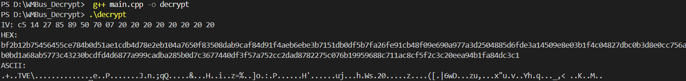

1) Explanation of W- M Bus telegram structure
Stands for Wireless-M Bus a wireless way to collect data from meters like electricity ,gas ,light and etc .The message they send is called Telegram.
Telegram = Header (basic info) + Encrypted data (secret part)
Header consists of following parts :-
  1)[M-Field] - 2 bytes (says the manufacturer)
  2)[A-Field] - 6 bytes (meter serial number + version + type)
  3)[CI] - 1 byte (control info)
  4)[ACC] - 1 byte (access number, changes each time)
  5)[STATUS] - 1 byte
  6)[CFG] - 1 byte (configuration)
Encrypted data - This part contains the actual meter values and extra fields.
It is locked using AES-128 encryption, so we cannot read it directly.

2) AES-128 CBC Decryption(Aligned with OMS Volume 2)
To decrypt the encrypted data, we need three things:
  1) Key – a 16-byte value given in the assignment
  2) IV (Initialization Vector) – must be built from the header
  3) Encrypted message – the second part of the telegram
AES-128 CBC mode uses these to get the decrypted output.
OMS tells us to create the IV using  things from the header:
OMS IV = [ A-Field (8 bytes) ] + [ ACC repeated 8 times].
1.	The A-Field consists of 8 bytes (Manufacturer ID, Device ID, Version, Device Type).
2.	The ACC (Access Number) is 1 byte and changes with every telegram.
3.	This ACC byte is repeated 8 times to complete the 16-byte IV.

AES-128 is applied in CBC mode, meaning each 16-byte block is decrypted using the key and then XOR with the previous block.

OMS (Open Metering System) Volume 2 defines:
•	How meters encrypt and decrypt data
•	How the IV is constructed
•	Security modes
  OMS Mode 5 requires:
•	Key Input
A 16-byte AES-128 key is used for decryption.
•	Telegram Parsing
The encrypted W-M Bus frame is read in hex format.
•	CI Field Check
If the CI (Control Information) byte is 0x7A, it indicates AES encrypted payload.
•	Extract OMS Metadata
•	A-Field (8 bytes before the CI)
•	ACC (Access Number, 1 byte)
•	Security Mode (must be 5)
•	IV Construction
IV = [A-Field (8 bytes)] + [ACC repeated 8 times]
•	Ciphertext Extraction
Encrypted data begins after the TPL header (after CI and ACC).
•	AES-128 CBC Decryption
Decrypt using:
•	AES-128 key
•	Constructed IV
•	Ciphertext (multiple of 16 bytes)
•	Remove Filler Bytes (0x2F)
OMS uses byte 2F as padding/filler.
Any trailing 0x2F bytes must be trimmed from the plaintext.
•	Output the Plaintext
Show in hex. Parsing of DIF/VIF can follow if required.

3) Instructions on how to build and run the code.
  I have used Vs code for debugging and running the code
  1) I created a file C++ file and written the code .
  2) I saved the code with name main.cpp and compiled it using g++ main.cpp -o decrypt
  3) once compilation was done it was ready to run I used .\decrypt command to run and got output.
OUTPUT :-

  

5) Examples of input of output.
Example 1:
   Key : 4255794d3dccfd46953146e701b7db68
Telegram :      a144c5142785895070078c20607a9d00902537ca231fa2da5889Be8df3673ec136aeBfB80d4ce395Ba98f6B3844a115e4Be1B1c9f0a2d5ffBB92906aa388deaa82c929310e9e5c4c0922a784df89cf0ded833Be8da996eB5885409B6c9867978dea24001d68c603408d758a1e2B91c42eBad86a9B9d287880083BB0702850574d7B51e9c209ed68e0374e9B01feBfd92B4cB9410fdeaf7fB526B742dc9a8d0682653
   OUTPUT :-
1.	CI index:
13
2.	CI value:
0x7a
3.	A-Field:
85 89 50 70 07 8c 20 60
4.	Access Number (ACC):
0x9d
5.	Security Mode:
5
6.	IV (OMS Mode 5):
85 89 50 70 07 8c 20 60 9d 9d 9d 9d 9d 9d 9d 9d
7.	Ciphertext:
37 ca 23 1f a2 da 58 89 be 8d f3 67 3e c1 36 ae bf b8 0d 4c e3 95 ba 98 f6 b3 84 4a 11 5e 4b e1 b1 c9 f0 a2 d5 ff bb 92 90 6a a3 88 de aa 82 c9 29 31 0e 9e 5c 4c 09 22 a7 84 df 89 cf 0d ed 83 3b e8 da 99 6e b5 88 54 09 b6 c9 86 79 78 de a2 40 01 d6 8c 60 34 08 d7 58 a1 e2 b9 1c 42 eb ad 86 a9 b9 d2 87 88 00 83 bb 07 02 85 05 74 d7 b5 1e 9c 20 9e d6 8e 03 74 e9 b0 1f eb fd 92 b4 cb 94 10 fd ea f7 fb 52 6b 74 2d c9 a8 d0 68 26 53
8.	Decrypted Plaintext (Raw Hex):
6f b2 73 98 2a ec 6a 5e 04 13 80 11 00 00 01 fd 17 00 42 6c ff ff 44 13 00 00 00 00 44 93 3c 00 00 00 00 84 01 13 00 00 00 00 c4 01 13 00 00 00 00 84 02 13 12 00 00 00 c4 02 13 00 00 00 00 84 03 13 ff ff ff ff c4 03 13 ff ff ff ff 84 04 13 ff ff ff ff c4 04 13 ff ff ff ff 84 05 13 ff ff ff ff c4 05 13 ff ff ff ff 84 06 13 ff ff ff ff c4 06 13 ff ff ff ff 84 07 13 ff ff ff ff c4 07 13 ff ff ff ff 84 08 13 ff ff ff ff 2f 2f 2f 2f
9.	Decrypted Plaintext (Trimmed):
6f b2 73 98 2a ec 6a 5e 04 13 80 11 00 00 01 fd 17 00 42 6c ff ff 44 13 00 00 00 00 44 93 3c 00 00 00 00 84 01 13 00 00 00 00 c4 01 13 00 00 00 00 84 02 13 12 00 00 00 c4 02 13 00 00 00 00 84 03 13 ff ff ff ff c4 03 13 ff ff ff ff 84 04 13 ff ff ff ff c4 04 13 ff ff ff ff 84 05 13 ff ff ff ff c4 05 13 ff ff ff ff 84 06 13 ff ff ff ff c4 06 13 ff ff ff ff 84 07 13 ff ff ff ff c4 07 13 ff ff ff ff 84 08 13 ff ff ff ff

Example 2 :
      INPUT :-
1.	AES-128 Key:
00112233445566778899aabbccddeeff
2.	Encrypted Telegram (Hex):
2f2f441012345678112233445566778899aabbccddeeff7a5a2030d129aabbccddeeff00112233445566778899aabbccddeeffddeeccbb
       OUTPUT :-
       1. CI index : 10
2.CI value : 0x7a
3.A-Field: 12 34 56 78 11 22 33 44
4.Access Number (ACC): 0x5a
5.Security Mode: 5
6.IV :12 34 56 78 11 22 33 44 5a 5a 5a 5a 5a 5a 5a 5a
7.Ciphertext: d1 29 aa bb cc dd ee ff 00 11 22 33 44 55 66 77 88 99 aa bb cc dd ee ff dd ee cc bb
8.Decrypted Plaintext (Raw Hex): 10 5e 23 11 00 01 00 00 2f 2f 2f 2f 2f 2f 2f 2f
9.Decrypted Plaintext (Trimmed): 10 5e 23 11 00 01 00 00

Compilation (Linux / macOS):
g++ main.cpp -o decrypt

Compilation (Windows with MinGW):
g++ main.cpp -o decrypt.exe

Run:
./decrypt --key <AES_KEY> --tele <ENCRYPTED_TELEGRAM>

